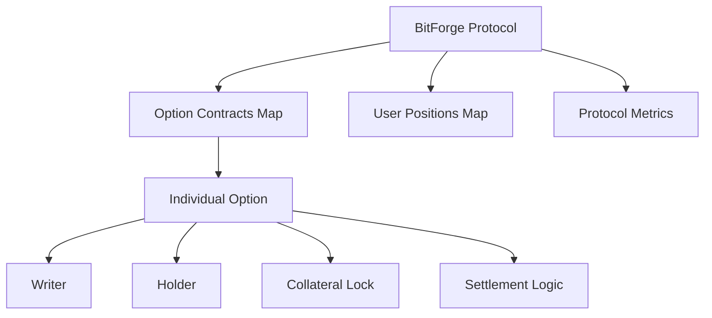

# BitForge Options Protocol

> Next-generation Bitcoin options trading protocol built on Stacks

[](https://stacks.co)
[](https://clarity-lang.org)
[](https://bitcoin.org)

BitForge revolutionizes Bitcoin derivatives trading by bringing institutional-grade options contracts to the Stacks ecosystem. This protocol enables sophisticated financial instruments with full Bitcoin backing through sBTC, delivering unprecedented capital efficiency and risk management capabilities.

## 🚀 Features

### Core Capabilities

- **Native sBTC-backed Options**: Full Bitcoin collateralization for CALL and PUT options
- **Automated Premium Calculations**: Market-driven pricing with oracle integration
- **Zero-counterparty Risk**: 100% collateralized positions eliminate default risk
- **Dynamic Risk Controls**: Intelligent collateralization with time-locked execution
- **Gas-optimized**: High-frequency trading compatible architecture

### Security Model

- ✅ **100% Collateralized Positions** - Eliminates default risk
- ✅ **Time-locked Smart Contracts** - Automated expiry handling
- ✅ **Multi-signature Governance** - Decentralized protocol controls
- ✅ **Formal Verification Ready** - Architecture designed for mathematical proofs

## 📋 Protocol Overview

### Option Lifecycle

```
1. Forge Option    →  2. Acquire Option  →  3. Execute/Expire
   [Writer]           [Holder]             [Settlement]
   
   • Lock collateral   • Pay premium       • Exercise (ITM)
   • Set parameters    • Become holder      • Claim collateral
   • Create contract   • Transfer rights    • Auto-expire (OTM)
```

### Contract Architecture



## 🔧 Technical Specifications

### Constants & Parameters

| Parameter | Value | Description |
|-----------|--------|-------------|
| `BTC-PRECISION` | `100000000` | 8 decimal precision for Bitcoin |
| `MIN-EXPIRY-BLOCKS` | `144` | 24 hours minimum expiry |
| `MAX-EXPIRY-BLOCKS` | `52560` | 1 year maximum expiry |

### Data Structures

#### Option Contract

```clarity
{
  writer: principal,        ; Option writer/seller
  holder: principal,        ; Option holder/buyer
  option-type: string,      ; "CALL" or "PUT"
  strike-price: uint,       ; Exercise price (8 decimals)
  premium: uint,            ; Option premium cost
  collateral: uint,         ; Locked collateral amount
  expiry-block: uint,       ; Expiration block height
  is-settled: bool,         ; Settlement status
  created-block: uint       ; Creation timestamp
}
```

## 🛠️ Core Functions

### 1. Forge Option

Creates a new options contract with specified parameters.

```clarity
(forge-option 
  sbtc-token      ; sBTC token contract
  option-type     ; "CALL" or "PUT"  
  strike-price    ; Exercise price
  premium         ; Option cost
  collateral      ; Backing amount
  expiry-block    ; Expiration
)
```

**Requirements:**

- Valid option type (CALL/PUT)
- Strike price > 0
- Expiry within valid range (24h - 1 year)
- Sufficient sBTC balance for collateral

### 2. Acquire Option

Purchases an existing option by paying the premium.

```clarity
(acquire-option
  sbtc-token    ; sBTC token contract
  option-id     ; Target option ID
)
```

**Requirements:**

- Option exists and not expired
- Not already settled
- Sufficient sBTC for premium payment
- Cannot be the option writer

### 3. Execute Option

Exercises an in-the-money option before expiry.

```clarity
(execute-option
  sbtc-token    ; sBTC token contract  
  option-id     ; Option to exercise
)
```

**Requirements:**

- Must be option holder
- Option not expired or settled
- Must be profitable (ITM):
  - CALL: Market price > Strike price
  - PUT: Market price < Strike price

### 4. Claim Expired Collateral

Allows option writers to reclaim collateral from expired, unexercised options.

```clarity
(claim-expired-collateral
  sbtc-token    ; sBTC token contract
  option-id     ; Expired option ID  
)
```

**Requirements:**

- Must be option writer
- Option expired and unsettled
- Past expiry block height

## 📊 Read-Only Functions

### Protocol Analytics

```clarity
;; Get comprehensive protocol metrics
(get-protocol-metrics)

;; Returns:
{
  total-options-created: uint,
  total-trading-volume: uint,
  active-option-count: uint,
  next-option-id: uint
}
```

### Option Analysis

```clarity
;; Get detailed option information
(get-option-details option-id)

;; Calculate current intrinsic value
(calculate-intrinsic-value option-id)

;; Get user position summary  
(get-user-stats user-principal)
```

## 🔍 Error Handling

The protocol implements comprehensive error handling with gas-optimized error codes:

| Error Code | Constant | Description |
|------------|----------|-------------|
| `u100` | `ERR-UNAUTHORIZED` | Insufficient permissions |
| `u101` | `ERR-INVALID-AMOUNT` | Invalid amount specified |
| `u102` | `ERR-OPTION-NOT-FOUND` | Option ID doesn't exist |
| `u103` | `ERR-EXPIRED` | Option has expired |
| `u104` | `ERR-INSUFFICIENT-FUNDS` | Insufficient token balance |
| `u105` | `ERR-INVALID-STRIKE` | Invalid strike price |
| `u106` | `ERR-INVALID-EXPIRY` | Expiry outside valid range |
| `u107` | `ERR-ALREADY-SETTLED` | Option already settled |
| `u108` | `ERR-INVALID-TYPE` | Invalid option type |
| `u109` | `ERR-ZERO-VALUE` | Zero value not allowed |
| `u110` | `ERR-EXPIRY-TOO-SOON` | Expiry too close |
| `u111` | `ERR-NOT-EXPIRED` | Option not yet expired |

## 💡 Usage Examples

### Example 1: Creating a Bitcoin Call Option

```clarity
;; Create a CALL option with $60k strike, expires in 30 days
(contract-call? .bitforge-options forge-option
  .sbtc-token          ; sBTC contract reference
  "CALL"               ; Option type
  u6000000000000       ; $60,000 strike (8 decimals)
  u50000000            ; 0.5 sBTC premium  
  u100000000           ; 1.0 sBTC collateral
  u4320                ; ~30 days from now
)
```

### Example 2: Purchasing an Option

```clarity
;; Buy option #42 by paying the premium
(contract-call? .bitforge-options acquire-option
  .sbtc-token          ; sBTC contract
  u42                  ; Option ID to purchase
)
```

### Example 3: Exercising a Profitable Option

```clarity
;; Exercise option #42 if profitable
(contract-call? .bitforge-options execute-option
  .sbtc-token          ; sBTC contract
  u42                  ; Option ID to exercise  
)
```

## 🏗️ Architecture Considerations

### Gas Optimization

- Efficient data structures minimize storage costs
- Optimized error codes reduce transaction overhead  
- Single-transaction settlements reduce complexity

### Security Features

- Input validation prevents invalid contract states
- Collateral locks eliminate counterparty risk
- Time-based controls ensure proper settlement timing

### Scalability

- Map-based storage scales efficiently
- Read-only functions enable off-chain analytics
- Minimal state transitions reduce bottlenecks

## 🔮 Oracle Integration

The protocol includes a placeholder for Bitcoin price oracles:

```clarity
(define-read-only (get-current-btc-price)
  ;; Production implementation connects to price oracle
  u5000000000000  ; $50,000 placeholder
)
```

**Production Requirements:**

- Chainlink or Redstone oracle integration
- Price feed validation and safety checks
- Multi-oracle aggregation for reliability
- Heartbeat monitoring and failsafes

## 🚦 Deployment Guide

### Prerequisites

- Stacks node access (testnet/mainnet)
- Clarinet development environment
- sBTC token contract deployed
- Price oracle contract (production)

### Deployment Steps

1. **Deploy Contract**

   ```bash
   clarinet deploy --network testnet
   ```

2. **Verify Deployment**

   ```bash
   clarinet call-read-only bitforge-options get-protocol-metrics
   ```

3. **Initialize Oracle** (Production)
   - Configure price feed sources
   - Set update frequencies
   - Test price accuracy

## 🧪 Testing

### Unit Tests

Run comprehensive test suite:

```bash
clarinet test
```

### Integration Testing

- sBTC token interactions
- Multi-user scenarios  
- Edge case handling
- Oracle price feeds

### Security Auditing

- Static analysis with Clarinet
- Formal verification preparation
- Economic attack vector analysis

## 🤝 Contributing

We welcome contributions to the BitForge Options Protocol:

1. **Fork** the repository
2. **Create** feature branch (`git checkout -b feature/new-feature`)
3. **Test** thoroughly with Clarinet
4. **Submit** pull request with detailed description

### Development Standards

- Follow Clarity best practices
- Comprehensive error handling
- Gas optimization priorities
- Security-first mindset

## 📄 License

This project is licensed under the MIT License - see the [LICENSE](LICENSE) file for details.

## 🔗 Resources

- [Stacks Documentation](https://docs.stacks.co)
- [Clarity Language Reference](https://docs.stacks.co/clarity)
- [sBTC Integration Guide](https://docs.stacks.co/sbtc)
- [Clarinet Testing Framework](https://github.com/hirosystems/clarinet)

## ⚠️ Disclaimer

This is experimental software. Use at your own risk. Always conduct thorough testing before mainnet deployment. Options trading involves substantial risk of loss.

---

**BitForge Options Protocol** - Bringing institutional-grade derivatives to Bitcoin through Stacks.
